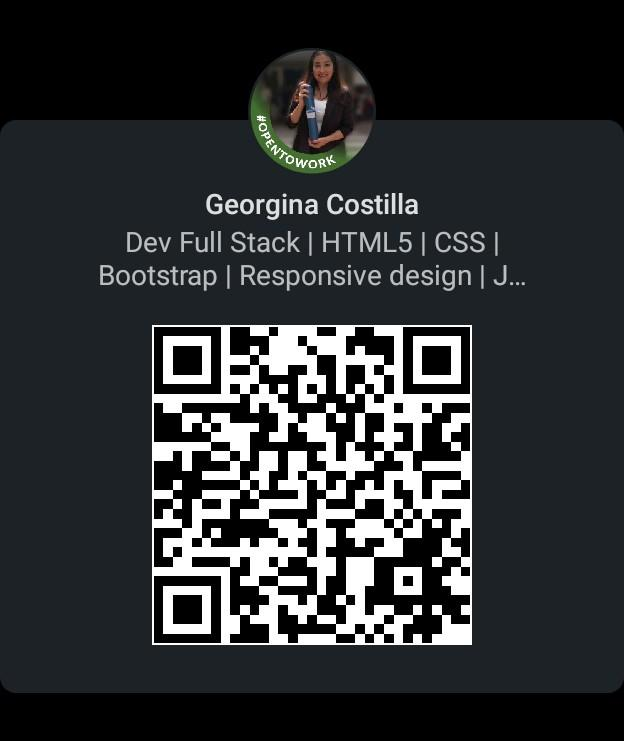

<link rel="stylesheet" href="https://cdnjs.cloudflare.com/ajax/libs/font-awesome/5.15.3/css/all.min.css" integrity="sha512-........" crossorigin="anonymous" />

# ¡Hola! 👋 Soy Georgina Costilla

¡Bienvenidos a mi perfil! Soy una entusiasta del aprendizaje constante con pasión por la programación y la comunicación; disfruto explorando nuevas tecnologías y desafíos en el mundo digital.

## Acerca de mí

- 🌍 Vivo en Tucumán - Argentina
- 🎓 Graduada en Ciencias de la Comunicación social- UNT
- 👩‍💻 Estudiante de Programacion en la UTN- FRT y en Rolling Code School 🚀 

## Tecnologías

- HTML5: <i class="fab fa-html5"></i>
- CSS3: <i class="fab fa-css3-alt"></i>
- Bootstrap: <i class="fab fa-bootstrap"></i>
- JavaScript: <i class="fab fa-js"></i>
- Programación Orientada a Objetos (POO): <i class="fas fa-object-ungroup"></i>
- C#: <i class="fab fa-windows"></i>
- SQL Server: <i class="fas fa-database"></i>
- Metodologías Ágiles (SCRUM): <i class="fas fa-tasks"></i>

## Objetivo académico

- Fusionar habilidades en Comunicación y Programación para impulsar mi crecimiento personal y profesional; busco aplicar esta combinación única en proyectos futuros, aportando una perspectiva versátil y habilidades tanto técnicas como comunicativas.

## Contacto

- 📧 Email: georginacostilla@gmail.com
- 💼 LinkedIn: [Georgina Costilla](https://www.linkedin.com/in/georgina-costilla/)

{:height="200px" width="200px"}

¡Bienvenido a mi rincón en GitHub! Siéntete libre de explorar mis proyectos y contactarme para futuras colaboraciones.

